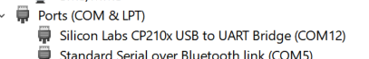
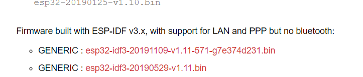
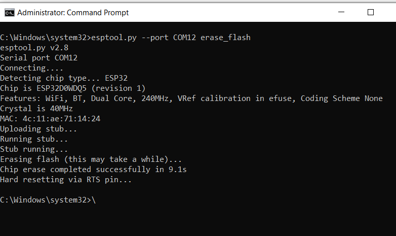
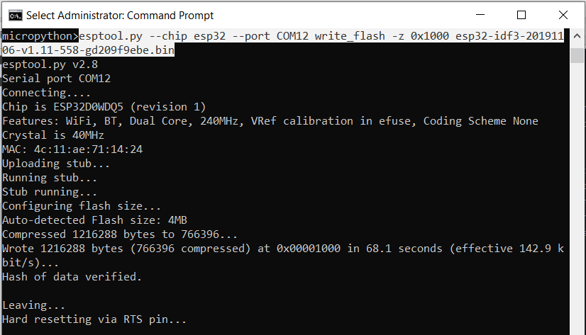
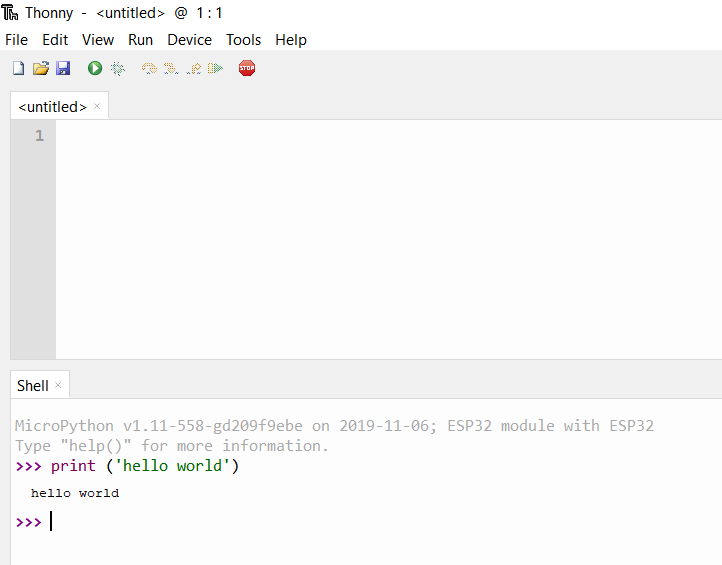

### Configuring the ESP 32 Board

Upon arriving, the ESP 32 is initially configured and flashed to operate with the Arduino Process language, and consequently had to be re-flashed to operate using micropython. The setup guide, found [here](http://docs.micropython.org/en/latest/esp32/tutorial/intro.html#esp32-intro), is a relatively straightforward document to follow along, although it was written with the assumption that the user is running a UNIX system. This part on configuring the board was done using a Windows system, hence, a modified version of the guide will be written here that features modifications to the commands to better suit a Windows system.

Firstly, **Hold the BOOT button while plugging in the board into the laptop, and continue holding it for about 10 seconds or so**. This sets the board into bootloader mode. it is a good idea to check the port number on which the board is interfacing on. This can very easily be done by pressing the Windows key, followed by entering `devmgmt.msc` and pressing enter. The device manager window should appear. Following that, scroll to the *COM & LPT* Ports, and expand the tree in that section.

The board should be registered as a 'USB to UART Bridge', and on this case, is interfacing on COM12. This port number will be needed later.

After finding which COM Port the board is on, the latest Micropython firmware should be downloaded from the [Micropython Page](https://micropython.org/download#esp32). Depending on your board configuration, select one of the options and download it.

In this case, the first option was used. It is worthwhile to note that the firmware is regularly updated, and the filenames will change accordingly as revisions are made.

While the download is in progress, it is necessary to install the Python development package from [Python's official website](https://www.python.org/downloads/). Install it and enable the option to add the Python environment to the PATH Variable, which allows python commands to be executed directly from the command prompt. Upon installing python, the flashing tool for the ESP32, which is currently the only way to flash the firmware onto the device, should be installed by running the command

 `pip install esptool`

in the command prompt. (Command prompt in windows can be accessed by pressing the windows button and typing `cmd` followed by enter.)

Once installation of the esptool is complete, it is now possible to wipe the old firmware on the ESP32 and install Micropython. Firstly, run the command

`esptool.py --port COMxx erase_flash`

to erase the previous firmware, where 'xx' is the port number on which the ESP32 is interfacing (12 in this case).

Upon sucessfully completing the wipe, the command prompt will indicate the above output, which marks the beginning of the next step, which is flashing in the micropython firmware. To flash the firmware, firstly change Command prompts working directory to the one where the firmware is stored (this can be done by right clicking on the folder, selecting properties, and copying the folder path, followed by entering `cd` and pasting the folder path there). Subsequently, enter

`esptool.py --chip esp32 --port COMxx write_flash -z 0x1000 yyyyyzzzzzz.bin`

where 'xx' is the COM Port number, and yyyyyzzzzz.bin is the file name of the firmware previously downloaded.

The highlighted section indicates the command entered for this particular instance. Upon completion, unplug, and reconnect the board to the laptop. By now, the ESP32 should be running on Micropython, and it should be possible to connect to it using a Python IDE of choice. In this case, Thonny was used, and in the output window something resembling the following should be seen:

It should also now be possible to run commands to verify that the board is functioning as per expected on Micropython.
